# CST321-Activity6
### Bash Shell scripting - File System Navigation

The [bash_shell_fileSystemNavigation.sh](bash_shell_fileSystemNavigation.sh) code first uses 'echo' to display the current directory '$PWD'.
Then, it changes to look at the home directory using 'cd ~'.
Lastly, it uses the find command to look in the Desktop for all of the files that contain '.c' which is all of the c programs that I have written for this course.
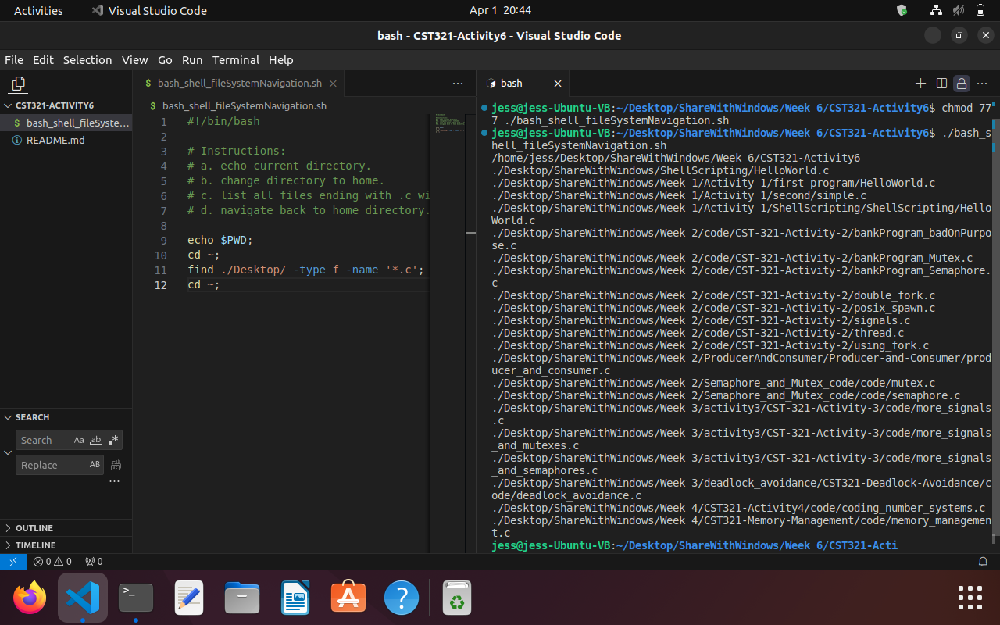

### Bash Shell scripting - Simple File Manipulation

The [bash_shell_simpleFileManipulation.sh](./bash_shell_simpleFileManipulation.sh) code first changes to the home directory then makes a new directory called 'mycode' and changes into that new directory.  It uses the find command to find files in the 'Desktop' directory that end with '.c' and copies them into the current directory.
Then, the program moves up a directory and makes a new directory called 'mycode2'.  All the files that are in the 'mycode' directory are copied into the new directory 'mycode2'.  The 'mycode' directory is renamed 'deadcode' and then deleted.
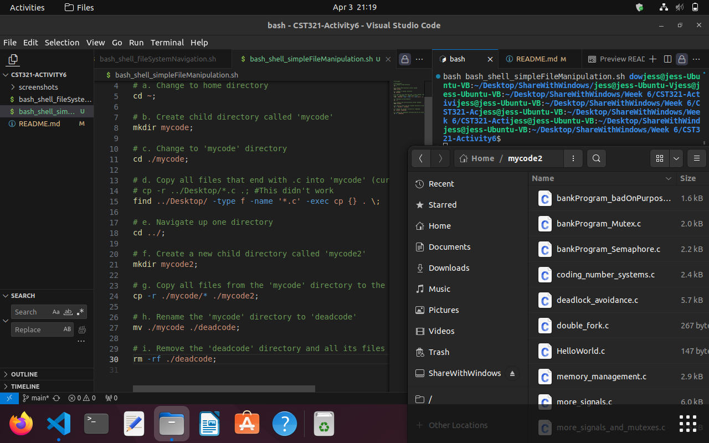

### Terminal - Simple Text File Viewing

Using the terminal to view files using various commands and options.

#### Using ```ls```, ```ls -a```, and ```ls -l``` on the home directory.
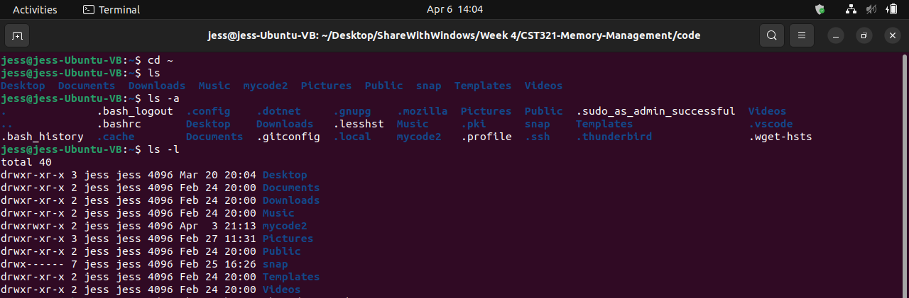

#### Using ```less``` to view a .c file.
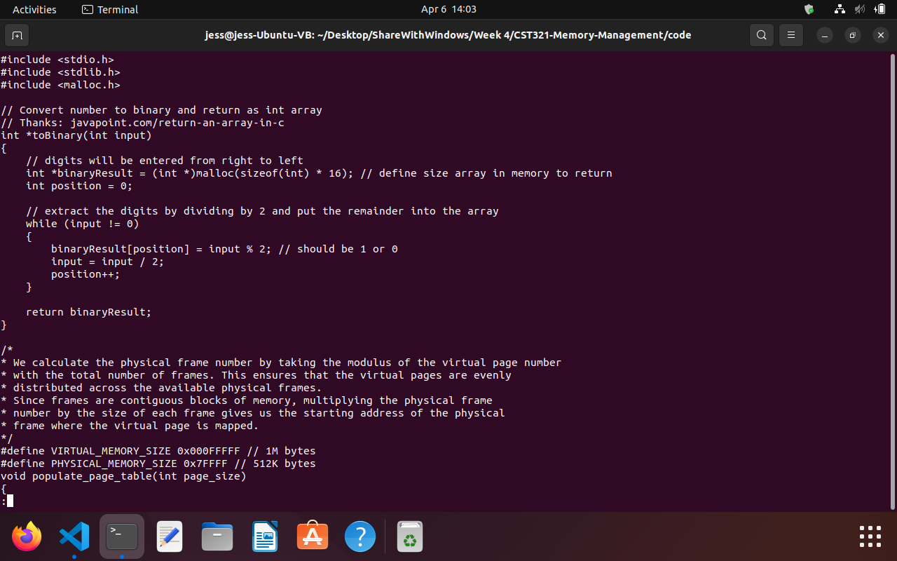

#### Using ```less -N``` to view a .c file with line numbers.
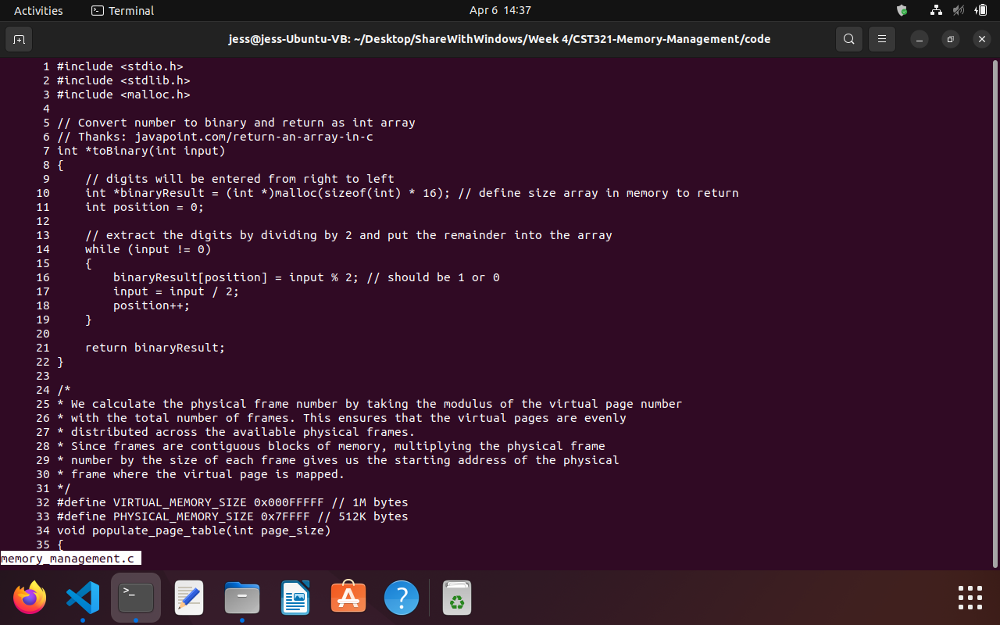

#### Using ```less /``` to search a .c file.
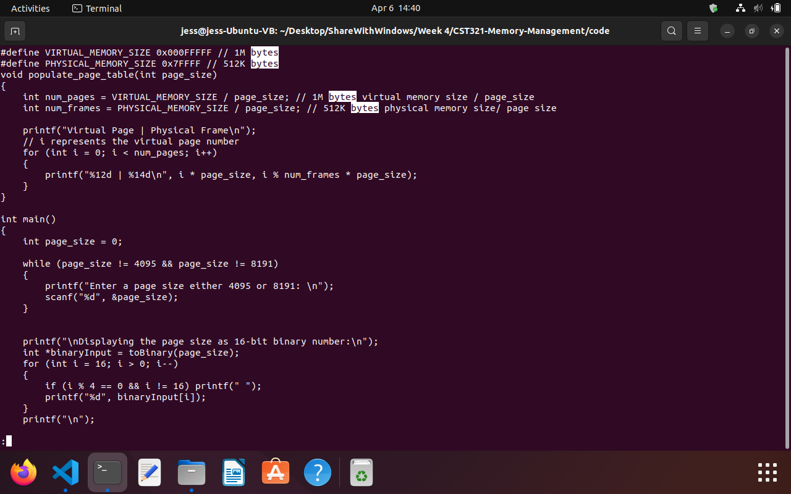

#### Using ```less -x``` to leave the file text visible after exiting the file.
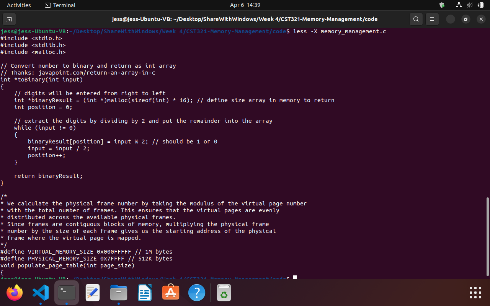

#### Using ```more``` to view a file.
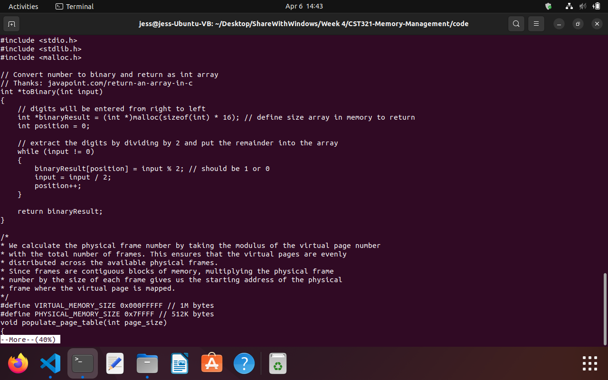

#### Using ```more +10``` to start 10 lines down in a file.
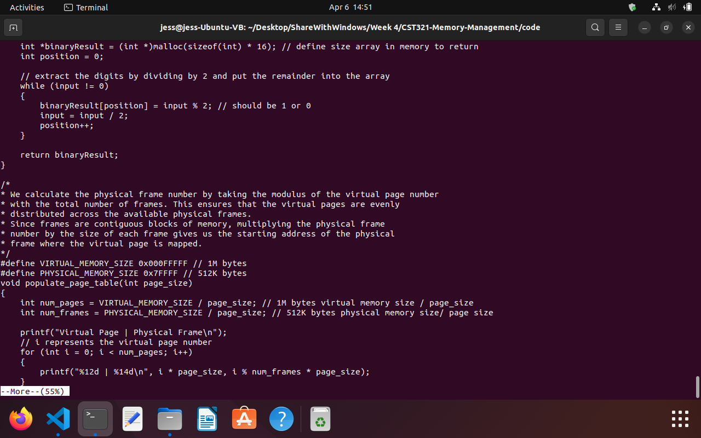

#### Using ```more -d``` to display the percent of the file.
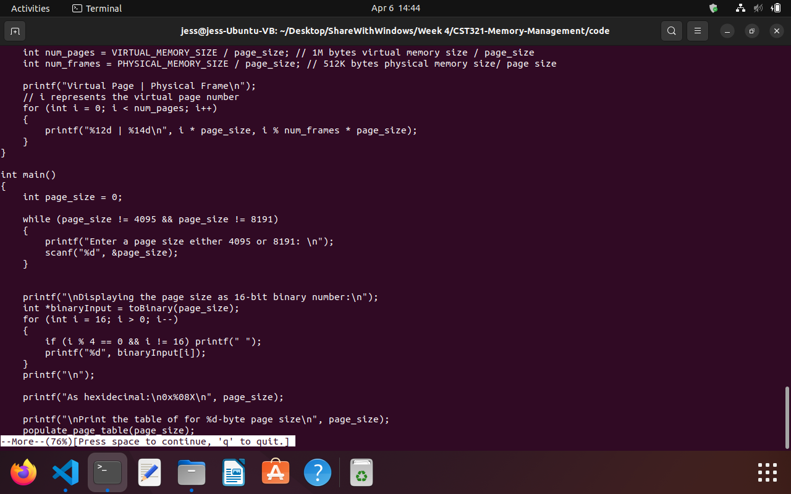

#### Using ```more -n``` to specify the number of lines that are displayed at a time.
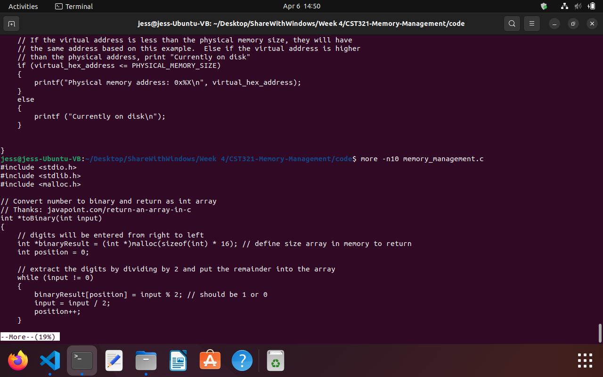

#### Using ```file``` command to view info about a .c file, home directory, and /bin directory.
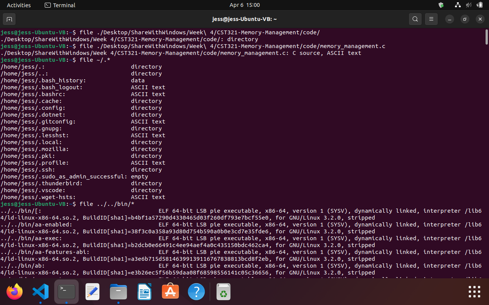