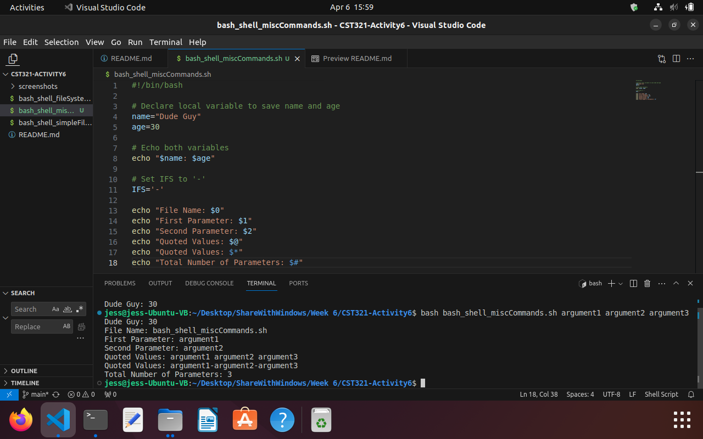
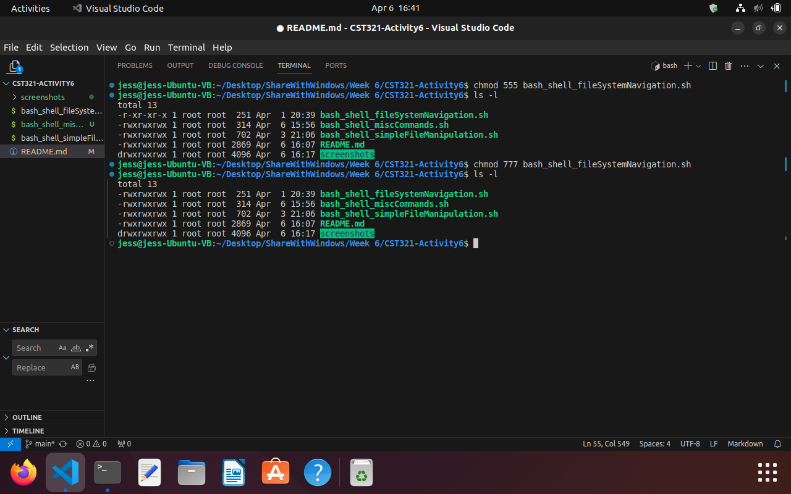
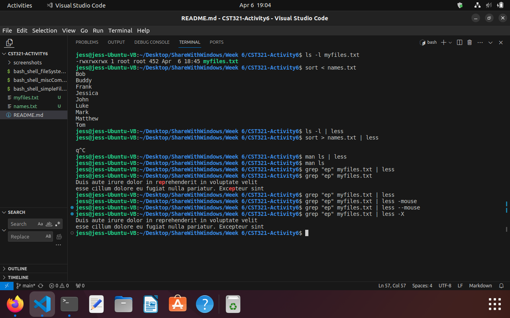
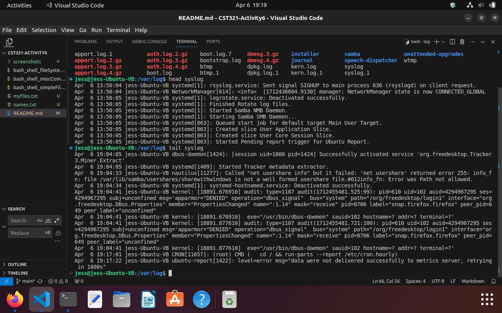
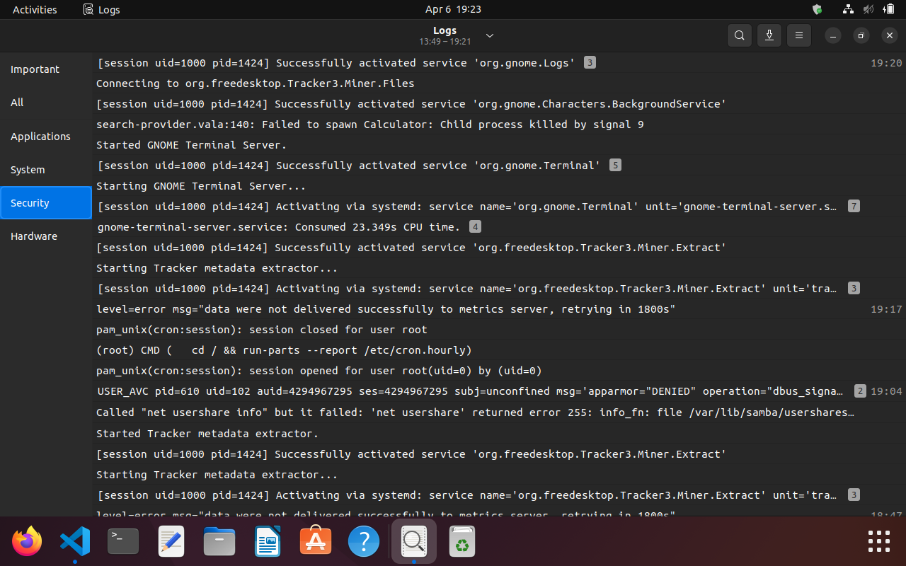
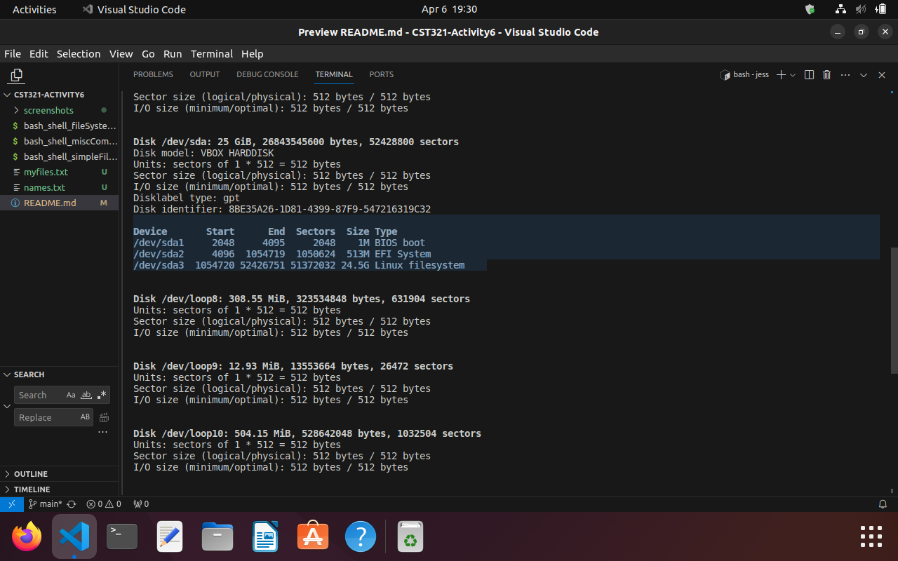
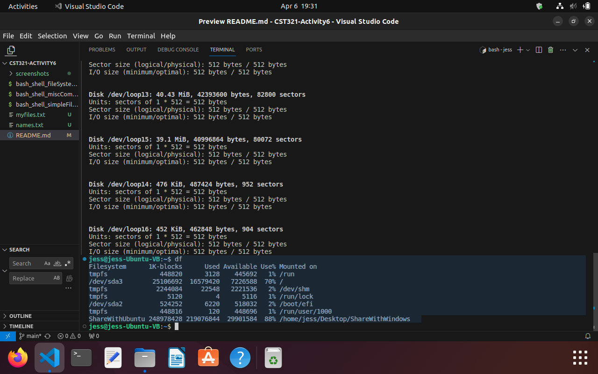
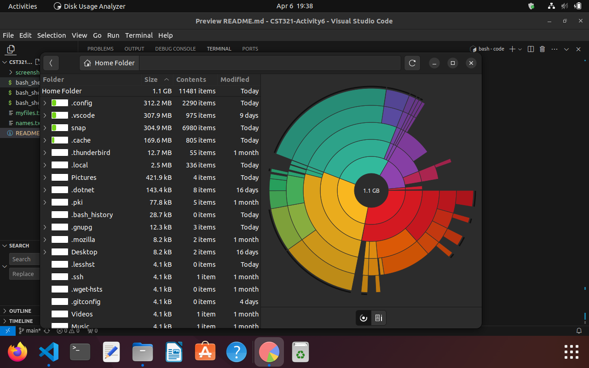

# CST321-Activity6
### Bash Shell scripting - File System Navigation

The [bash_shell_fileSystemNavigation.sh](bash_shell_fileSystemNavigation.sh) code first uses 'echo' to display the current directory '$PWD'.
Then, it changes to look at the home directory using 'cd ~'.
Lastly, it uses the find command to look in the Desktop for all of the files that contain '.c' which is all of the c programs that I have written for this course.


### Bash Shell scripting - Simple File Manipulation

The [bash_shell_simpleFileManipulation.sh](./bash_shell_simpleFileManipulation.sh) code first changes to the home directory then makes a new directory called 'mycode' and changes into that new directory.  It uses the find command to find files in the 'Desktop' directory that end with '.c' and copies them into the current directory.
Then, the program moves up a directory and makes a new directory called 'mycode2'.  All the files that are in the 'mycode' directory are copied into the new directory 'mycode2'.  The 'mycode' directory is renamed 'deadcode' and then deleted.


### Terminal - Simple Text File Viewing

Using the terminal to view files using various commands and options.

#### Using ```ls```, ```ls -a```, and ```ls -l``` on the home directory.


#### Using ```less``` to view a .c file.


#### Using ```less -N``` to view a .c file with line numbers.


#### Using ```less /``` to search a .c file.


#### Using ```less -x``` to leave the file text visible after exiting the file.


#### Using ```more``` to view a file.


#### Using ```more +10``` to start 10 lines down in a file.


#### Using ```more -d``` to display the percent of the file.


#### Using ```more -n``` to specify the number of lines that are displayed at a time.


#### Using ```file``` command to view info about a .c file, home directory, and /bin directory.


### Bash Shell - Misc. Commands
The [miscCommands.sh](./bash_shell_miscCommands.sh) program uses echo to first print a string and int.  Then echo is used to print the various parameters that are assigned to the variables using ```$0```, ```$1```, and ```$2```.



### Bash Shell - Permissions
First, the ```chmod 555``` command is used on the 'bash_shell_fileSystemNavigation.sh' file and then ```ls -l``` is used to display the permissions after the change was made.  The permissions shown are ```-r-xr-xr-x``` which means that the owner 'root', group 'root', and all others have -r-x read and execute permissions but not write.  Then, the ```chmod 777``` command is used to change permissions and ```ls -l``` to display the files and permissions. The permissions are now```-rwxrwxrwx``` which means that the all users have full read, write, and execute permissions.



### Terminal - Redirection
This part uses terminal commands to adjust the view of files.
- ```sort < name.txt``` sorted the names in the file.
- ```ls -l | less``` piped the result of ls -l into a view where it can be viewed by pages.  This would be helpful with very long lists.
- I attempted to pipe a manual into less, but it looks the same.  
- Lastly, I used grep to search and pipe the results into less with various options just to see what would happen.  Again, this would be useful when there are many results.



### Terminal - Head and Tail Files
Used head and tail commands to view the first part and last part of the syslog file. Then compared it to what was in the logs from looking at them in the logs application.



### Disk Utilities
Using the terminal ```sudo fdisk -l``` command lists available disk devices and partitions on the system.  I have 3 different devices listed currently of type: BIOS boot, EFI System, and Linux filesystem.


Using the ```df``` command, the various mounts are listed.


Using the Disk Usage Analyzer app displays results of the Home Folder.

